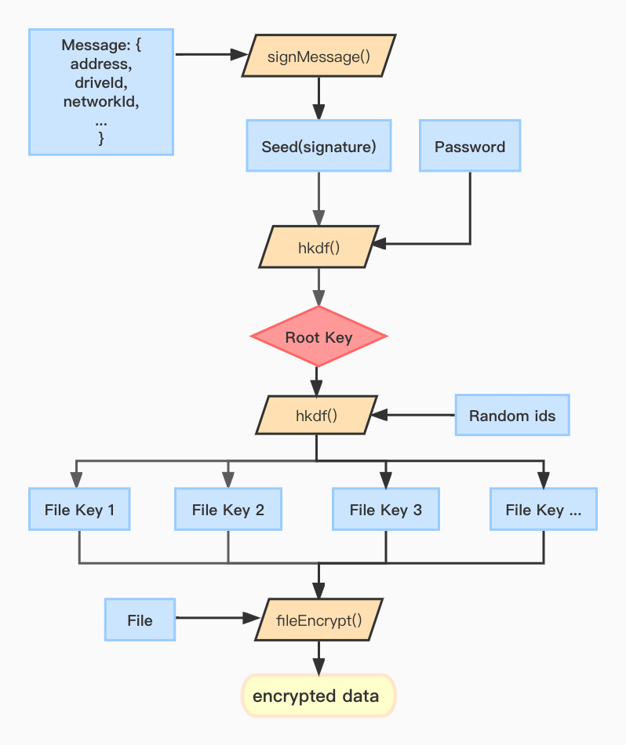

# W3Drive

## Introduction
W3Drive is a decentralized personal file storage service based on the Web3Q chain. Anyone can store their files safely and permissionless. 
The uploaded files will be encrypted to ensure that only the owner can view and delete them. 
   
W3Drive can be visited here: https://web3q.io/w3drive.w3q/.


## How does it work
W3Mail is a fully decentralized dApp which means the front-end code, back-end (smart contract) code, and users' files are all stored on the chain. The front-end contract is w3drive.w3q and the backend contract is SimpleW3Drive.

### w3drive.w3q
[w3drive.w3q](https://web3q.io/w3ns.w3q/#/domains/w3drive.w3q) is a w3ns domain name, which maps a contract address, 
the contract is a FlatDirectory contract that stores w3drive's website files.

FlatDirectory is the implementation of the web3 storage data contract. Click [here](https://docs.web3q.io/tutorials/migrate-your-website-to-web3q-in-5-mins) for details.

The flow chart is as follows:


#### Secret key seed
Every user's file is encrypted by a unique AES256 key, and all those keys are derived from one root secret key. This root secret key is determined by a secret key seed which is a signature signed by the user's wallet using some user-related info (user address, drive id, network id, etc).
```
const provider = new ethers.providers.Web3Provider(window.ethereum);
const signer = provider.getSigner();
const message = createSiweMessage(
            address,
            driveId,
            networkId,
            'Login in with W3DRIVE app.'
);
return await signer.signMessage(message);
```

#### Register
Use the "hkdf" function to derive the 32-bit root secret key. Encrypt user drive id with root key, 
and store the encrypted data and drive id on the chain.
```
import hkdf from 'futoin-hkdf';
const keyByteLength = 32;
const keyHash = 'SHA-256';
export const deriveDriveKey = async (signature, password) => {
	const info = password;
	const driveKey = hkdf(Buffer.from(signature), keyByteLength, {info, hash: keyHash});
	return urlEncodeHashKey(driveKey);
}
export const createDrive = async (driveId, signature, password) => {
    const driveKey = await deriveDriveKey(signature, password);
    const driveEncryptData = await driveEncrypt(driveKey, driveId);

    const fileContract = FileContract();
    await fileContract.createDrive(driveId, driveEncryptData);
    ...
}
```

#### Login
Regenerate the root key through the signature and password, and use the root key to decrypt the
encrypted data stored in the chain. If the decryption is successful, the login is successful.
```
export const encryptDrive = async (signature, password, encryptData) => {
    const driveKey = await deriveDriveKey(signature, password);
    try {
        await driveDecrypt(driveKey, encryptData);
        return true;
    } catch (e) {
        return false;
    }
}
```

#### Upload
Each file will have a unique id, and the secret key of the file will be derived from the root key and the id.
The file will be encrypted with this key before uploading.
```
const authTagLength = 16;
const algo = 'aes-256-gcm'; // crypto library does not accept this in uppercase. So gotta keep using aes-256-gcm

export const fileEncrypt = async (fileKey, data) => {
	const keyData = Buffer.from(fileKey, 'base64');
	const iv = crypto.randomBytes(12);
	const cipher = crypto.createCipheriv(algo, keyData, iv, {authTagLength});
	const encryptedBuffer = Buffer.concat([cipher.update(data), cipher.final(), cipher.getAuthTag()]);
	return {
		cipher: 'AES256-GCM',
		cipherIV: iv.toString('base64'),
		data: encryptedBuffer
	};
}
```

#### Download
First derive the secret key of the file from the root key and file id. Then extract all the chunk data of the file from 
the contract. In the end, decrypt the data using the file key.
```
const authTagLength = 16;
export async function fileDecrypt(fileKey, iv, data) {
	try {
		const authTag = data.slice(data.byteLength - authTagLength, data.byteLength);
		const encryptedDataSlice = data.slice(0, data.byteLength - authTagLength);
		const iv = Buffer.from(cipherIV, 'base64');
		const keyData = Buffer.from(fileKey, 'base64');
		const decipher = crypto.createDecipheriv(algo, keyData, iv, { authTagLength });
		decipher.setAuthTag(authTag);
		return Buffer.concat([decipher.update(encryptedDataSlice), decipher.final()]);
	} catch (err) {
		console.log('Error decrypting file data');
		return Buffer.from('Error', 'ascii');
	}
}
```
<br>

### SimpleW3Drive
SimpleW3Drive is used to manage user-uploaded files.

#### Storage structure
```
contract SimpleW3drive {
    FlatDirectory public fileFD; // file storage contract
    mapping(address => FilesInfo) fileInfos; // // User upload info mapping
}
```

#### Register
Before uploading files, you need to create a drive in the contract.
```
function createDrive(bytes memory uuid, bytes memory driveEncrypt) public {
    FilesInfo storage info = fileInfos[msg.sender];
    require(keccak256(info.uuid) == keccak256(""), "Drive is created");
    info.uuid = uuid;
    info.driveEncrypt = driveEncrypt;
}
```

#### Upload
```
function writeChunk(
    bytes memory uuid, 
    bytes memory name, 
    bytes memory fileType, 
    uint256 chunkCount, 
    uint256 chunkId, 
    bytes calldata data
)
    public
    payable
    isCreatedDrive
{
    bytes32 uuidHash = keccak256(uuid);
    FilesInfo storage info = fileInfos[msg.sender];
    if (info.fileIds[uuidHash] == 0) {
        // first add file
        info.files.push(File(block.timestamp, chunkCount, uuid, name, fileType, iv));
        info.fileIds[uuidHash] = info.files.length;
    }
    // because the gas fee has a maximum limit, the file is too large and needs to be split into multiple chunks for uploading
    fileFD.writeChunk{value: msg.value}(getNewName(msg.sender, uuid), chunkId, data);
}
```

#### Read
```
function getFileInfos()
    public
    view
    returns (
        uint256[] memory times,
        bytes[] memory uuids,
        bytes[] memory names,
        bytes[] memory types
    )
{
    uint256 length = fileInfos[msg.sender].files.length;
    times = new uint256[](length);
    uuids = new bytes[](length);
    names = new bytes[](length);
    types = new bytes[](length);
    for (uint256 i; i < length; i++) {
        times[i] = fileInfos[msg.sender].files[i].time;
        uuids[i] = fileInfos[msg.sender].files[i].uuid;
        names[i] = fileInfos[msg.sender].files[i].name;
        types[i] = fileInfos[msg.sender].files[i].fileType;
    }
}
```

#### Download
```
function getFile(bytes memory uuid, uint256 chunkId) public view returns(bytes memory) {
    (bytes memory data, ) = fileFD.readChunk(getNewName(msg.sender, uuid), chunkId);
    return data;
}
```

#### File Name
Files are saved and read by name. Adding the user address before the file name can avoid duplicate names, and the file name format is address/fileName.
```
function getNewName(address author,bytes memory name) public pure returns (bytes memory) {
    return abi.encodePacked(Strings.toHexString(uint256(uint160(author)), 20),'/',name);
}
```
